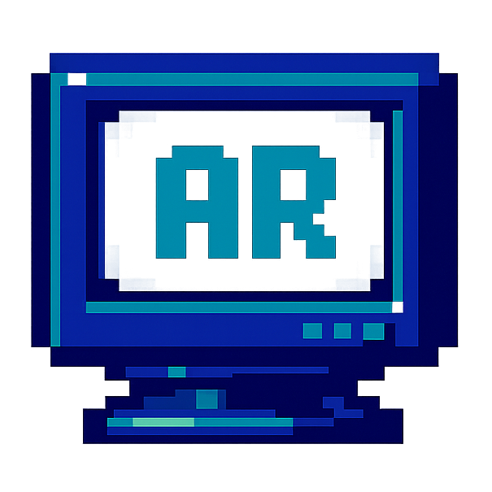

<p align="center">
  
</p>

<h1 align="center">y2k-portfolio</h1>

<p align="center">
  A Windows 98 desktop simulator — built as a personal portfolio.
  <br />
  Because your resume deserves more than a generic Bootstrap card.
</p>

<p align="center">
  
  
  
  
  
  
</p>

---

## Table of Contents

- [About](#about)
- [Features](#features)
- [Tech Stack](#tech-stack)
- [Screenshots](#screenshots)
- [Getting Started](#getting-started)
- [Usage](#usage)
- [Project Structure](#project-structure)
- [Deployment](#deployment)
- [Author](#author)

---

## About

**y2k-portfolio** is a React-based interactive portfolio that recreates the look and feel of a Windows 98 desktop. Instead of a traditional scrollable page, visitors boot into a fully functional desktop environment — complete with draggable windows, a taskbar, a Start menu, and desktop icons that open résumé sections.

The project was built to showcase Alex Rivera's work in a way that stands out from the endless stream of single-page portfolios. It targets recruiters, developers, and design-conscious visitors who appreciate pixel-perfect nostalgia paired with modern frontend engineering.

---

## Features

- **Boot screen animation** — CRT scanline overlay, animated block progress bar, and a simulated Windows startup sequence.
- **Draggable & resizable windows** — Each section (About, Experience, Skills, Projects, Contact) opens as its own window with minimize, maximize, and close controls.
- **Taskbar with Start menu** — Bottom taskbar shows open windows, active state highlighting, and a classic Start menu with app shortcuts.
- **Desktop icons** — Pixel-art icons with single-click selection and double-click launch, arranged in a vertical column.
- **Responsive mobile mode** — Windows open maximized on small screens; desktop icons reflow into a compact column; touch interactions adapted for tap vs. double-tap.
- **Win98-styled UI** — Custom scrollbars, 3D beveled borders, raised/sunken button states, silver-and-teal color palette, and `Tahoma` system font throughout.
- **Contact form** — In-window form with success dialog, loading state, and Win98-styled inputs.
- **Accordion skill browser** — Categorized skills with animated progress bars and expand/collapse state.
- **Keyboard accessible** — All interactive elements reachable and operable via keyboard navigation.

---

## Tech Stack

| Category   | Technology                                                              |
| ---------- | ----------------------------------------------------------------------- |
| Framework  | [React 18](https://react.dev)                                           |
| Build tool | [Vite 4](https://vitejs.dev)                                            |
| Styling    | [Tailwind CSS 3](https://tailwindcss.com)                               |
| Animation  | [Framer Motion 9](https://www.framer.com/motion/)                       |
| Routing    | [React Router 6](https://reactrouter.com)                               |
| Icons      | [Pixelarticons](https://pixelarticons.com)                              |
| Scrollbar  | [tailwind-scrollbar](https://github.com/adoxography/tailwind-scrollbar) |
| Deployment | [Vercel](https://vercel.com)                                            |


---

## Screenshots

| Boot Screen                                                           | Desktop                                                          |
| --------------------------------------------------------------------- | ---------------------------------------------------------------- |
|  |  |

| About Window                                                 | Skills Accordion                                               |
| ------------------------------------------------------------ | -------------------------------------------------------------- |
|  |  |

---

## Getting Started

### Prerequisites

- Node.js 18+
- npm 9+

### Installation

```bash
git clone https://github.com/Silaenn/porto_modern.git
cd y2k-portfolio
npm install
```

### Environment Variables

No environment variables are required. The project is fully self-contained and uses no external API keys.

---

## Usage

Start the development server:

```bash
npm run dev
```

Open [http://localhost:5173](http://localhost:5173) in your browser. You will see the Windows 98 boot screen animation, followed by the desktop interface.

Build for production:

```bash
npm run build
```

Preview the production build:

```bash
npm run preview
```

---

## Project Structure

```
y2k-portfolio/
├── index.html                 # HTML entry point (preconnect + Google Fonts)
├── vite.config.js             # Vite configuration
├── tailwind.config.cjs        # Tailwind theme (fonts, colors, screens)
├── postcss.config.cjs         # PostCSS (Tailwind + Autoprefixer)
├── vercel.json                # Vercel deployment config
├── public/
│   └── logo.png               # Favicon
└── src/
    ├── main.jsx               # React entry point
    ├── index.css              # Global styles, CSS variables, scrollbar
    ├── App.jsx                # Root component (boot → desktop flow)
    ├── styles.js              # Shared Tailwind class strings
    ├── constants/
    │   └── index.js           # Data arrays (services, experience, projects)
    ├── components/
    │   ├── Win98Dialog.jsx    # Reusable modal dialog
    │   ├── DesktopAppIcons.jsx# Pixel-art icon components
    │   ├── pages/
    │   │   ├── BootScreen.jsx      # Windows 98 boot animation
    │   │   ├── Desktop.jsx         # Desktop layout + state management
    │   │   ├── DesktopIcon.jsx     # Individual desktop icon
    │   │   ├── Taskbar.jsx         # Bottom taskbar + Start menu
    │   │   ├── Window.jsx          # Draggable/resizable window
    │   │   ├── AboutPage.jsx       # About me + education
    │   │   ├── ExperiencePage.jsx  # Work history timeline
    │   │   ├── SkillsPage.jsx      # Categorized skill bars
    │   │   ├── ProjectsPage.jsx    # Project cards grid
    │   │   └── ContactPage.jsx     # Contact form
    │   └── index.js           # Barrel export
    ├── hoc/
    │   └── SectionWrapper.jsx # Framer Motion section HOC
    └── utils/
        └── motion.js          # Animation variants
```

---

## Deployment

The project is configured for one-click deployment on **Vercel** via the included `vercel.json`. To deploy your own instance:

1. Push the repo to GitHub.
2. Import the project into [Vercel](https://vercel.com/new).
3. Vercel auto-detects Vite and applies the correct build settings.
4. Deploy.

The build outputs a static `dist/` folder that Vercel serves with SPA fallback routing.

---

## Author

**Silaenn**

- GitHub: [@Silaenn](https://github.com/Silaenn)
- Repo: [github.com/Silaenn/porto_modern](https://github.com/Silaenn/porto_modern)

---

<p align="center">
  <sub>Built with React, Vite, and way too much nostalgia for 640×480.</sub>
</p>
